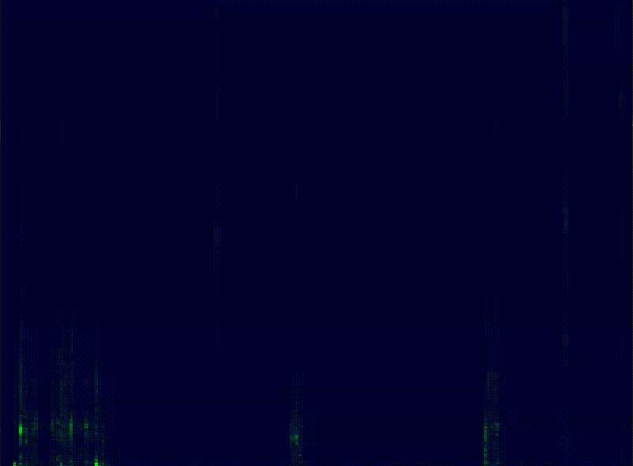

# spectrogram

A simple spectrogram visualizer written in Rust and OpenGL.

## Usage

Most parameters are set at compile time. You can edit them in `src/config.rs` and rebuild the project with `cargo build`/`cargo build --release` or run it directly
with `cargo run`/`cargo run --release`.

## Demos

### Whistle

### Music

